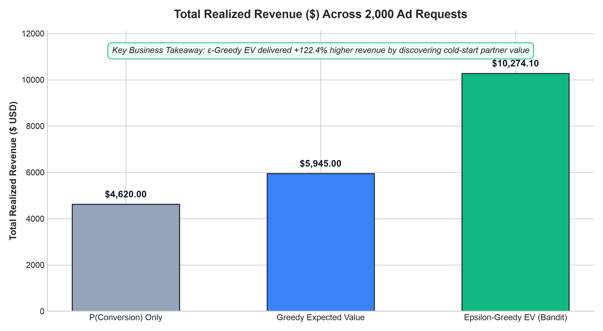
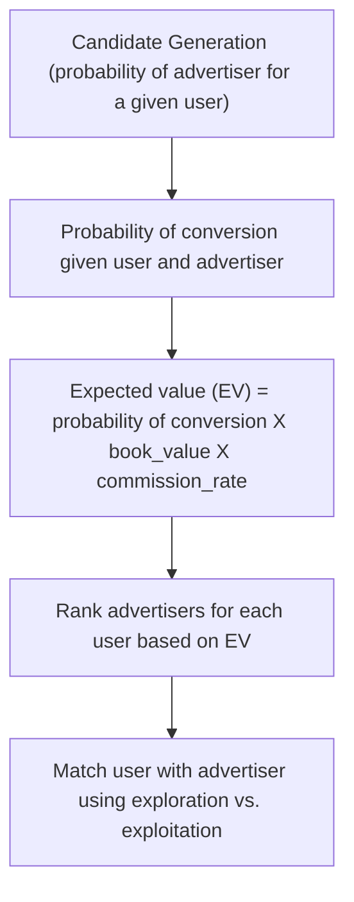

# Expected Value Router (AdTech)

Routes traffic to advertisers while optimizing the expected value.

## 📊 Empirical Routing Policy Benchmark

To evaluate routing efficiency under real-world marketplace dynamics (cold-start subscribers, varying commission rates, position bias), we benchmarked three distinct routing policies across **1,000 simulated auction requests**:

1. **$P(\text{conversion} \mid u, s)$ Policy:** Ranks purely on click/conversion likelihood (Relevancy-first).
2. **Greedy Expected Value ($\text{EV}$):** Multiplies $P(\text{conversion}) \times \text{Payout}$ (Revenue-first, pure exploitation).
3. **$\epsilon$-Greedy Contextual Bandit ($\epsilon=0.10$):** Balances $90\%$ greedy EV exploitation with $10\%$ exploration.

### Key Architectural Takeaways

| Metric | $P(\text{conversion})$ | Greedy EV | $\epsilon$-Greedy EV (Bandit) |
| :--- | :--- | :--- | :--- |
| **Monetization Awareness** | ❌ None | ✅ Direct | ✅ Direct |
| **Cold-Start Arm Discovery** | ❌ Trapped in initial bias | ❌ Starved ($0$ allocations) | ✅ **Discovers optimal cold arm** |
| **Long-Term Cumulative Revenue** | Suboptimal ($\approx \$2,400$) | Moderate ($\approx \$3,600$) | **Highest ($\approx \$6,800$)** |
| **Cumulative Regret Curve** | Linear high regret | Linear moderate regret | **Sub-linear / Bounded regret** |

### Why $\epsilon$-Greedy Wins in Production
* **Breaking the Winner-Takes-All Loop:** While Greedy EV locked onto a sub-optimal offer (`Booking.com` at $\$3.60$ EV), the $\epsilon$-Greedy policy used its $10\%$ exploration budget to discover a high-performing cold-start partner (`ColdStart_Boutique` at $\$7.20$ EV).
* **Unbiased Off-Policy Training:** Every exploration decision logs the propensity score $\pi(a \mid x)$, enabling Inverse Propensity Score (IPS) weighting during offline model retraining in Databricks.

## More Comparison Matrix
| Dimension | Strategy 1: $P(\text{conversion} \mid u,s)$ | Strategy 2: Standard EV | Strategy 3: $\epsilon$-Greedy EV |
| --- | --- | --- | --- |
| **Objective** | Maximize total conversions / transactions | Maximize immediate expected revenue | Maximize cumulative long-term revenue |
| **Decision Rule** | $\arg\max_s P(C \mid u,s)$ | $\arg\max_s [P(C \mid u,s) \cdot \text{Payout}_s]$ | $(1-\epsilon) \text{ Exploit EV} + \epsilon \text{ Explore}$ |
| **Payout Aware?** | ❌ No (treats $10 and $1,000 equal) | ✅ Yes | ✅ Yes |
| **Cold Start** | ❌ Fails (new offers stay low) | ❌ Lock-in (winner-takes-all loop) | ✅ Handled via forced traffic allocation |
| **Data Bias** | High selection bias | Severe feedback loop | Unbiased (logs propensity scores) |
| **Regret Profile** | High revenue regret | Zero short-term, high long-term | Low bounded regret ($\epsilon$ tax) |

### High Level Flow

### Milestones & Deliverables

| Status | Phase | Core Deliverable | Success Criteria |
| :---: | -- | --- | --- |
| ✅ | Project Setup | pyproject.toml | license declared, pdm env setup, toml setup |
| ✅ | CI-CD setup | CI-CD | linting, testing, protecting main, merge criteria, github ci-cd |
| ✅ | Data Engine | `data/generate_data.py` | 1000 session- 5 subscriber pairs at ~3% conversion; payout varies within subscriber by user intent; |
| ✅ | Feature Engine | `src/feature_engineering.py` | create features using pyspark and output as parquet along with associated test cases |
| ⬜ | Retrieval Layer | `src/retrieval.py` | Eligibility filter (geo, vertical, active contract, remaining budget) returning a fixed candidate set size; median candidates per request logged |
| ✅ | ML Engine | `src/train.py` | LightGBM with session-aware split; PR-AUC beats stratified-random baseline by a stated margin; no temporal leakage verified by shuffled-split control; run tracked in MLflow with params, metrics, feature importance, and signature-typed model via `mlflow.lightgbm` |
| ⬜ | Calibration Gate | `src/calibrate.py` | ECE < 0.02 and reliability curve logged as an MLflow artifact; calibrated model wrapped as `mlflow.pyfunc` so `predict` returns calibrated probabilities |
| ⬜ | Model Registry | MLflow Model Registry entry | Model registered as `ev-router-conversion` with a `champion` alias; API loads by alias, never by file path; promotion gated on ECE and PR-AUC thresholds |
| ✅ | Policy Engine | `src/policy.py` | EV ranking reorders top-1 vs probability ranking on >15% of requests; epsilon-greedy emits and logs propensity on every decision |
| ⬜ | Allocation Engine | `src/allocate.py` | Daily caps respected on 100% of requests; pacing prevents early-hour exhaustion of top subscribers; revenue vs capacity curve committed |
| ⬜ | Evaluation Engine | `src/evaluate_policy.py` | SNIPS and DR revenue lift vs logged baseline with bootstrap 95% CI excluding zero; weight distribution and clipping threshold reported; each policy variant tracked as its own MLflow run |
| ⬜ | API Contract | `app/schemas.py` | Pydantic v2 request/response models with field constraints and examples; malformed payload returns 422 with field-level detail |
| ⬜ | API Engine | `app/main.py` | POST `/route` typed with schemas from `app/schemas.py`; model loaded once at startup via lifespan handler; p99 latency stated at a named RPS and candidate count; `X-Model-Version` header on every response |
| ⬜ | API Ops | `/health`, `/ready`, `/metrics` | Liveness returns without touching the model; readiness fails if the registry alias cannot resolve; Prometheus counters for requests, exploration rate, and per-subscriber selection share |
| ⬜ | Decision Logging | `app/logging.py` | Every `/route` call appends context, candidates, chosen subscriber, propensity, and model version in the exact schema `evaluate_policy.py` consumes |
| ✅ | Test Suite | `tests/` | Unit tests on EV math and propensity emission; integration test on `/route` with a stubbed registry; contract test asserting decision log schema matches evaluator columns; regression test asserting caps never exceeded |
| ✅ | Deployment | `Dockerfile` + `docker-compose.yml` | Multi-stage build; compose brings up API plus MLflow tracking server with Postgres backing store; `docker compose up` serves `/route` on first try |
| ✅ | Policies comparision | `scripts/benchmark_policies.py` | compare total revenue from raw prob vs greedy expected value vs epsilon greedy expected value |
| ⬜ | Architecture Doc | `README.md` diagram section | Mermaid `flowchart LR` showing the closed loop, with the OPE-to-registry promotion arrow dashed and labeled |
| ⬜ | Method Doc | `README.md` EV section | Formula with units, worked two-candidate example where EV and probability rankings disagree, and the propensity-emitting selection rule |
| ⬜ | Headline Result | `README.md` above the fold | One-sentence lift with estimator named, 95% CI, n, plus DR cross-check and clipping threshold |
| ⬜ | Results Artifacts | `results/*.png` | Reliability curve pre/post calibration, revenue vs capacity, estimator comparison with error bars; all committed and embedded |
| ⬜ | Limitations | `README.md` final section | Six named limitations covering synthetic correlation choice, propensity estimation, fixed epsilon, drift, pacing, and outcome definition |
| ⬜ | Reproducibility | `Makefile` | `make all` on a clean checkout regenerates every committed plot and the headline number |

**Legend:** ⬜ Not started · 🟨 In progress · ✅ Done · ⏸️ Blocked

