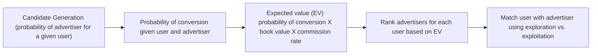

# Expected Value Router (AdTech)

Routes traffic to advertisers while optimizing the expected value.

### High Level Flow

```mermaid
flowchart LR
    A["Candidate Generation (probability of advertiser for a given user)"] -->
    B["Probability of conversion given user and advertiser"]
    B --> C["Expected value (EV) probability of conversion X book value X commission rate"]
    C --> D["Rank advertisers for each user based on EV"]
    D --> E["Match user with advertiser using exploration vs. exploitation"]
```

### TODO

