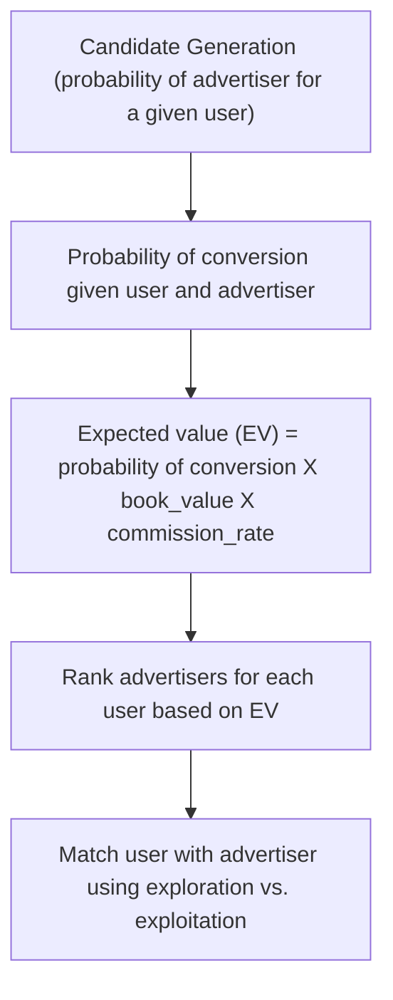

# Expected Value Router (AdTech)

Routes traffic to advertisers while optimizing the expected value.

### High Level Flow

### Milestones & Deliverables

| Status | Phase | Core Deliverable | Success Criteria |
| :---: | -- | --- | --- |
| 🟨 | Project Setup | pyproject.toml | license declared, pdm env setup, toml setup |
| 🟨 | CI-CD setup | CI-CD | linting, testing, protecting main, merge criteria, github ci-cd |
| 🟨 | Data Engine | `data/generate_data.py` | 100,000 session-subscriber pairs at ~3% conversion; payout varies within subscriber by user intent; payout-probability correlation between -0.3 and 0; generator seed and config logged as an MLflow run |
| ⬜ | Retrieval Layer | `src/retrieval.py` | Eligibility filter (geo, vertical, active contract, remaining budget) returning a fixed candidate set size; median candidates per request logged |
| ⬜ | ML Engine | `src/train.py` | LightGBM with session-aware split; PR-AUC beats stratified-random baseline by a stated margin; no temporal leakage verified by shuffled-split control; run tracked in MLflow with params, metrics, feature importance, and signature-typed model via `mlflow.lightgbm` |
| ⬜ | Calibration Gate | `src/calibrate.py` | ECE < 0.02 and reliability curve logged as an MLflow artifact; calibrated model wrapped as `mlflow.pyfunc` so `predict` returns calibrated probabilities |
| ⬜ | Model Registry | MLflow Model Registry entry | Model registered as `ev-router-conversion` with a `champion` alias; API loads by alias, never by file path; promotion gated on ECE and PR-AUC thresholds |
| ⬜ | Policy Engine | `src/policy.py` | EV ranking reorders top-1 vs probability ranking on >15% of requests; epsilon-greedy emits and logs propensity on every decision |
| ⬜ | Allocation Engine | `src/allocate.py` | Daily caps respected on 100% of requests; pacing prevents early-hour exhaustion of top subscribers; revenue vs capacity curve committed |
| ⬜ | Evaluation Engine | `src/evaluate_policy.py` | SNIPS and DR revenue lift vs logged baseline with bootstrap 95% CI excluding zero; weight distribution and clipping threshold reported; each policy variant tracked as its own MLflow run |
| ⬜ | API Contract | `app/schemas.py` | Pydantic v2 request/response models with field constraints and examples; malformed payload returns 422 with field-level detail |
| ⬜ | API Engine | `app/main.py` | POST `/route` typed with schemas from `app/schemas.py`; model loaded once at startup via lifespan handler; p99 latency stated at a named RPS and candidate count; `X-Model-Version` header on every response |
| ⬜ | API Ops | `/health`, `/ready`, `/metrics` | Liveness returns without touching the model; readiness fails if the registry alias cannot resolve; Prometheus counters for requests, exploration rate, and per-subscriber selection share |
| ⬜ | Decision Logging | `app/logging.py` | Every `/route` call appends context, candidates, chosen subscriber, propensity, and model version in the exact schema `evaluate_policy.py` consumes |
| ⬜ | Test Suite | `tests/` | Unit tests on EV math and propensity emission; integration test on `/route` with a stubbed registry; contract test asserting decision log schema matches evaluator columns; regression test asserting caps never exceeded |
| ⬜ | Deployment | `Dockerfile` + `docker-compose.yml` | Multi-stage build; compose brings up API plus MLflow tracking server with Postgres backing store; `docker compose up` serves `/route` on first try |
| ⬜ | Architecture Doc | `README.md` diagram section | Mermaid `flowchart LR` showing the closed loop, with the OPE-to-registry promotion arrow dashed and labeled |
| ⬜ | Method Doc | `README.md` EV section | Formula with units, worked two-candidate example where EV and probability rankings disagree, and the propensity-emitting selection rule |
| ⬜ | Headline Result | `README.md` above the fold | One-sentence lift with estimator named, 95% CI, n, plus DR cross-check and clipping threshold |
| ⬜ | Results Artifacts | `results/*.png` | Reliability curve pre/post calibration, revenue vs capacity, estimator comparison with error bars; all committed and embedded |
| ⬜ | Limitations | `README.md` final section | Six named limitations covering synthetic correlation choice, propensity estimation, fixed epsilon, drift, pacing, and outcome definition |
| ⬜ | Reproducibility | `Makefile` | `make all` on a clean checkout regenerates every committed plot and the headline number |

**Legend:** ⬜ Not started · 🟨 In progress · ✅ Done · ⏸️ Blocked

